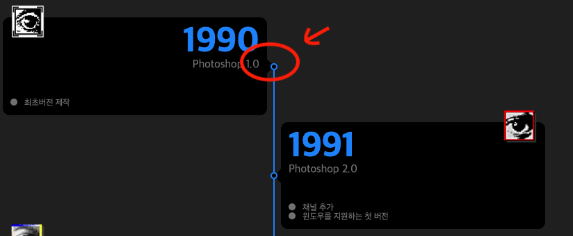

# Potoshop-History


> 소개 : 빔캠프님 특강에서 과제로 주어졌던 History of Potoshop입니다.

> 프로젝트 주소 : https://hun-se.github.io/Potoshop-History/

</br>

## 1. 제작 기간 & 참여 인원

- 2days & 개인프로젝트

</br>

## 2. 사용 기술

#### `Front-end`

- HTML/CSS

</br>

## 3. 핵심 사항

<details>
<summary><b>nagative-margin</b></summary>
<div markdown="1">

```CSS
 .content-main .content-timeline:after {
    content: '';
    background-color: #1c90ff;
    position: absolute;
    width: 2px;
    margin: 70px auto -50px;
    left: 0;
    right: 0;
    top: 0;
    bottom: 0;

}
```

</div>
</details>

- `native-margin`을 이용하여 부모요소를 벗어나는 효과를 주었습니다.

<details>
<summary><b>margin: x%</b></summary>
<div markdown="1">

```CSS
.content-main .content-timeline>li:nth-child(even) {
    margin-left: 52%;
}
```

```CSS
.content-main .content-timeline>li:nth-child(odd) {
    margin-right: 52%;
}
```

</div>
</details>

- margin에 %값을 주어서 해당 비율로 여유공간을 사용하여 각 요소를 정렬하였다.

</br>

## 4.어려웠던점

- 가상선택자를 사용해 만들었던 페이지 가운데 부분 파란색 구분선을 만드는것에 어려움을 느꼇다.
  <details>
  <summary><b>이미지</b></summary>
  <div markdown="1">

    

    </div>
    </dtails>

<br>
- 선에 위치하는 원모양의 배치는 margin과 position으로 적절한 비율로 정확한 배치를 하였지만, 선의 여백과 길이는 position으로  일일히 px로 배치하느라 정확성이 떨어지는 것 같다.

- positon에 px값을주어 원모양을 배치하면 화면의 크기가 변화할때 위치가 바뀌면서 ui꺠지는 문제발생.

- 해결: `<li>` 태그내에 요소들을`<div>`로 wrap해주고 postion에는 0값을 주고 nagative-margin으로 문제해결

<details>
<summary><b>코드보기</b></summary>
<div markdown="1">

```CSS
.content-timeline>li:nth-child(odd) year::after {
    content: "";
    position: absolute;
    right:0;
    top: 0;
    bottom: 0;
    width: 10px;
    height: 10px;
    border: 2px solid #1c90ff;
    background-color: #000;
    border-radius: 50%;
    box-sizing: border-box;
    margin: auto -16px;
    z-index: 90;
}
```

</div>
</details>

</br>

## 5. 배운점

- margin에 %를 사용하여 요소들을 정렬하는 방법을 배웠다.
- 가상 선택자 `nth-child(odd)` 와 `nth-child(even)`을 사용하여 홀수와 짝수 자식요소에 스타일을 적용하는 법을 배웠다.
- position을 이용하여 보다 자유로운 레이아웃 배치를 사용할 수 있게 되었다.
- margin-nagative를 사용하여 부모요소에 벗어나는 레이아웃 배치를 할 수 있게 되었다.

## 6. 회고

- margin과 postion등 을 활용하면서 레이아웃을 보다 쉽게 구현 할 수 있게 되었다.

<br>

# 4월 28일 수정사항

종찬님의 특별강의를 듣고 부족한 부분을 수정하였다

1.  timeline은 시간의 흐름을 나타내기 때문에 순서가 상관없는 ul보다는 순서에따른 리스트를 나타내는 ol로 쓰는게 시멘틱하다고 생각해서 수정하였다.

      <details>
      <summary><b>코드보기</b></summary>
      <div markdown="1">

        ```html
        <ol class="content-timeline">
          <li>
            
            <p class="date-photo">1990</p>
            <p class="version-photo">Photoshop 1.0</p>
            <ul class="description-photo">
              <li>최초버전 제작</li>
            </ul>
          </li>
          <li>
            
            <p class="date-photo">1991</p>
            <p class="version-photo">Photoshop 2.0</p>
            <ul class="description-photo">
              <li>채널 추가</li>
              <li>윈도우를 지원하는 첫 버전</li>
            </ul>
          </li>
          <li>
            
            <p class="date-photo">1994</p>
            <p class="version-photo">Photoshop 3.0</p>
            <ul class="description-photo">
              <li>탭 형식의 팔레트 메뉴 추가</li>
              <li>레이어 추가</li>
            </ul>
          </li>

          }
        </ol>
        ```

        <br>

        </div>
        </details>

<br>

2. li요소의 margin-left와 margin-right는 50%를 사용하기 / 직관적인 ui와 표현이 가능하며 여백을위해 비율을 조정하지 않는다.

- 이때 여백을 주려고 li내의 요소들을 div로
  감싸주어서 여백을 주었다.
- 이는 다른 ui배치하기에도 용이하다.

  <details>
  <summary><b>코드보기</b></summary>
  <div markdown="1">

  ```html
  <li>
    <div class="year year">
      
      <p class="date-photo">1990</p>
      <p class="version-photo">Photoshop 1.0</p>
      <ul class="description-photo">
        <li>최초버전 제작</li>
      </ul>
    </div>
  </li>
  ```

  </div>
  </details>

<br>

3.  timeline에 스타일을 추가하였다.

        <details>
        <summary><b>이미지 보기</b></summary>
        <div markdown="1">

        

        </div>
        </details>

    <br>

## 배운점

- 기본구조에서 wrapper로 요소컨턴츠에 맞는 ui설계한다. 이는 유지보수성에 유리해지고 레이아웃을 잡을때 보다 편하게 해준다.

- wrapper에는 고정크기를 주고 안에 컨텐츠는 고정값을 주지말것, wrapper에 크기에따라 켄텐츠는 반응하게 하기 위함

- 디테일, 유지보수, 확장성 고려할것

## 회고

- 수업을 듣고 난 후 코드를 수정할때 css를 수정하는데 어려움이 있었다.
- 보다 깔끔하게 코드를 정리하는 습관을 들여야 겠다고 생각했다.
- 공통되는 속성을 가진 요소들은 한프로퍼티로 공통으로 적용시켜서 코드양을 줄이는 연습이 필요한 것 같다.
- 다른 사람이 보아도 보기에 편한 코드를 짜도록 노력해야겠다.
